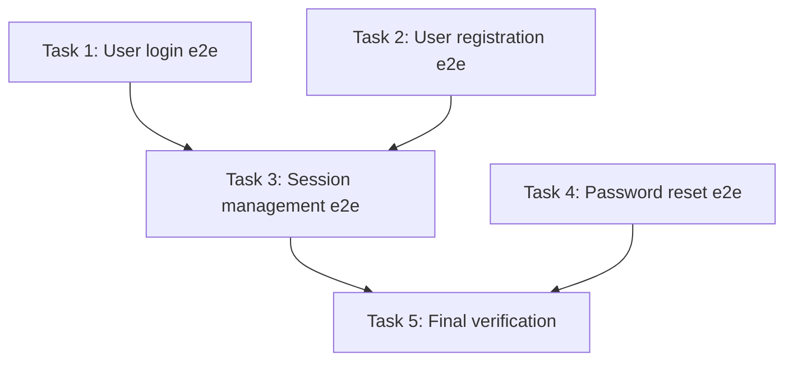

# Design Skill Refinement — Design

## Overview

Restructure the `/kk:design` skill's idea refinement (Step 3) and task creation (Step 6) to produce better-structured designs with explicit scope boundaries, surfaced assumptions, and vertically-sliced implementation tasks. Adds two reference files (frameworks.md, refinement-criteria.md) adapted from addyosmani/agent-skills' idea-refine skill, and updates `/kk:review-design` to check for the new design outputs.

## Problem Statement

The design skill's Step 3 (idea refinement) is understructured. The instruction "ask questions one at a time" produces unfocused conversations that jump to solutions without validating the problem. There is no framework for what questions to ask, no gate on understanding the problem before designing, and no structured way to explore alternatives before committing to one.

Step 6 (task creation) lacks slicing guidance. Tasks default to horizontal layers — all database work, then all API work, then all UI work — which defers integration risk to the end. There is no size enforcement, no parallel execution markers, and no dependency visualization.

Designs also lack explicit scope boundaries (no "Not Doing" list) and assumption surfacing. Hidden assumptions stay implicit and only surface when they break during implementation. The review-design skill has no awareness of these expected outputs, so it cannot catch their absence.

## Goals

1. Restructure Step 3 into sub-phases: HMW framing → hard gate (who/success/constraints) → proportional diverge → CoVe-assisted converge → explicit assumption and scope outputs
2. Add frameworks.md and refinement-criteria.md as selectable reference files for diverge and converge phases
3. Enrich Step 6 with vertical slicing mandate, size enforcement (S/M/L with L forbidden), parallel markers, slicing strategy selection, and ASCII dependency graphs
4. Require Assumptions and Not Doing sections in design.md (Step 5), with Not Doing elevated to tasks.md header
5. Update review-design to check for new required sections and task format conventions
6. Ship spec-style evals for the highest-risk new behaviors: hard gate enforcement, proportional diverge routing, and review-design catching missing/weak conventions
7. Pin upstream source and include license attribution in adapted reference files
8. Document pal integration and Mermaid graphs as future improvements in addendums

## Non-Goals

1. Changing existing-task-process.md (resume WIP flow) — separate concern, not affected
2. Changing the implement skill — new task fields (Size, Can run in parallel with, Not Doing header, dependency graph) are additive; implement already reads tasks.md and follows whatever structure it finds
3. Implementing pal-based stress-testing — deferred to addendum as future improvement
4. Changing the profile detection system — stable and unaffected
5. Adding Mermaid dependency graphs — deferred to addendum; ASCII format used for universal readability

## Architecture

### Step 3 Sub-phases

The current Step 3 is a single block. It becomes five sequential sub-phases, running after profile detection (which stays in its current position — profile `questions.md` feeds into 3a-3b):

**3a. HMW Framing.** Restate the idea as a "How Might We" problem statement before asking refinement questions. Present to user for confirmation or correction. Forces clarity on what is being solved before architecture discussions begin. The HMW format comes from frameworks.md, already loaded during the instruction-load phase.

**3b. Hard Gate.** Block progress until three things are explicitly answered:

1. **Who is this for** — specific user or persona, not "everyone"
2. **What does success look like** — measurable outcome, not a feature name
3. **Technical/system constraints** — what existing systems, infrastructure, or boundaries must be respected

One question at a time, multiple choice preferred. The agent may not advance to diverge until all three are confirmed. This prevents designing solutions that conflict with the project's actual technical landscape.

**3c. Proportional Diverge.** The agent uses the already-loaded frameworks.md for available lenses (SCAMPER, HMW, First Principles, JTBD, Constraint Mapping, Pre-mortem, Analogous Inspiration) and selects lenses that fit the idea — never runs every framework mechanically. Two paths based on complexity:

- **Non-trivial ideas** (multiple valid approaches, significant unknowns, architectural choices): generate 2-3 alternative directions using selected lenses. Present each with a one-sentence trade-off summary.
- **Simple ideas** (single-concern, low-uncertainty, obvious path): propose the direct implementation path plus briefly mention one alternative optimized for a different constraint (e.g., "We could also do X if you want to prioritize extensibility over simplicity"). Ask which to proceed with.

Before generating alternatives, the agent states which path it is taking and why: "This looks like a straightforward single-path problem — I'll propose the direct approach plus one alternative. Want me to explore more broadly instead?" This prevents silent misclassification of complexity. Never skip diverge silently — the user always sees at least two options.

**Rejection loop:** If the user rejects all alternatives, ask what constraint or dimension was missed, then loop back to 3c with that input as an additional lens.

**3d. Converge.** The agent uses the already-loaded refinement-criteria.md for the evaluation rubric (User Value, Feasibility, Differentiation).

**Default: manual criteria-based analysis.** Evaluate each direction against the rubric dimensions. Present a pros/cons matrix and recommend one direction with a one-line rationale per rejected alternative.

**CoVe for verifiable claims only.** When alternatives make specific factual or codebase claims — "API X supports feature Y", "library Z handles concurrency this way", "the existing auth middleware already does W" — invoke `/kk:chain-of-verification:isolated` to verify those claims. CoVe is fact-check oriented; it is not effective for subjective design trade-offs. The agent evaluates whether verifiable claims exist, then confirms the verification approach with the user before invoking CoVe.

**CoVe fallback triggers.** If CoVe is invoked and its verification questions do not reference any specific technical constraint, dependency, or trade-off from the alternatives (i.e., they could apply to any idea), or if CoVe's answers for all alternatives are substantively identical — skip the CoVe results and rely on the manual criteria-based analysis alone. Note the fallback in the design doc.

**3e. Surface Outputs.** Before moving to Step 4, produce two explicit artifacts:

- **Assumptions** — what is baked into the chosen direction but has not been validated. Each assumption should be specific enough to be testable.
- **Not Doing** — explicit scope exclusions with a one-line reason each. Becomes a first-class artifact that persists into design.md and tasks.md header.

### Reference Files

Two new files in the design skill directory, loaded during the mandatory instruction-load phase (SKILL.md step 2) — before any subject-matter engagement. Per the skill workflow ordering rule (CLAUDE.md §Skill workflow ordering), these are rubric/methodology files and therefore classify as instructions. The mandatory-order directive in SKILL.md's Workflow section must be updated to name these files alongside the existing instruction set:

**frameworks.md** — A menu of ideation lenses the agent draws from selectively during 3c. Lightly adapted from idea-refine's frameworks.md:

- SCAMPER (Substitute, Combine, Adapt, Modify, Put to other uses, Eliminate, Reverse) — best for improving existing features/systems
- How Might We (HMW) — best for reframing stuck thinking
- First Principles — best for breaking out of incremental thinking
- Jobs to Be Done (JTBD) — best for ensuring solution matches actual user need
- Constraint Mapping — best for exploring what becomes possible when a limitation is lifted
- Pre-mortem ("it failed — why?") — best for exposing hidden risks before committing
- Analogous Inspiration — best for generating structurally different variations from other domains

Each framework has "Best for" guidance. Top-level instruction: "Pick the lens that fits the idea — don't run every framework mechanically."

Light adaptation: product-specific examples (restaurant apps, startup concepts) removed. Brief SE-context framing note added. Structure and quality criteria preserved. Source pinned to a specific commit SHA (not `main`) for reproducibility.

**Attribution:** Both reference files include a license/attribution header noting the upstream source (addyosmani/agent-skills), the pinned commit SHA, and that the original is MIT-licensed. The MIT license requires preserving the copyright notice in substantial copies.

**refinement-criteria.md** — The evaluation rubric used during 3d. Three dimensions:

- **User Value** — painkiller vs vitamin. Questions: can you name specific users? What do they do today? How often? Red flags: "everyone could use this."
- **Feasibility** — technical (does the tech exist, hardest problem), resource (minimum effort for MVP), time-to-value (how fast to something testable). Red flags: "we just need to solve [hard research problem] first."
- **Differentiation** — types ranked: new capability > 10x improvement > new audience > new context > better UX > cheaper.

Plus MVP scoping rules: one job done well, riskiest assumption first, time-box not feature-list, mandatory Not Doing list.

Light adaptation: same as frameworks.md — trim consumer examples, keep structural rubric. Value/feasibility matrix preserved.

### Step 5 Changes

Two required sections added to design.md output:

- **Assumptions** — carried from Step 3e. Each specific enough to be validated or invalidated during implementation.
- **Not Doing** — carried from Step 3e. Explicit scope exclusions with rationale.

All other Step 5 guidance unchanged.

### Step 6 Changes

Existing guidance (H2 per task, checkbox subtasks, dependencies, status, final verification task) stays. Six additions:

1. **Not Doing list in tasks.md header.** Added to header metadata alongside Design/Implementation/Status/Created. Concise version — exclusion names without extended rationale. The implement skill reads tasks.md first; this puts scope boundaries front and center.

2. **Vertical slicing mandate.** Each task delivers one complete, testable user-facing path. Explicit anti-pattern: "Do not create tasks that complete an entire layer (all database work, then all API work, then all UI work). This defers integration risk to the end."

3. **Size tags.** `**Size:** S/M/L` field on each task. S = 1-2 files, M = 3-5 files, L = 5+ files. Size measures complexity, not raw file count — exclude boilerplate registrations, test fixtures, and config entries that are mechanical consequences of the main change. Hard rule: L is forbidden as a single task — must be broken into smaller vertical slices.

4. **Slicing strategy selection.** Three strategies, one-sentence definitions:
   - **Vertical** (default): each task delivers one complete path from input to output, testable in isolation.
   - **Contract-First**: define the interface/API boundary first, then implement each side independently. Use when introducing a new external boundary.
   - **Risk-First**: tackle the most uncertain piece first to surface unknowns early. Use when one task carries significantly more uncertainty.
   Strategy noted per-task only when deviating from default Vertical.

5. **Parallel markers.** `**Can run in parallel with:**` field listing task numbers with no blocking dependency, or `—`.

6. **ASCII dependency graph.** A `## Dependency Graph` section at the end of tasks.md. Written once by design, never updated by implement.

7. **Review scope recommendation.** At the end of Step 6, recommend invoking `/kk:review-design <feature>` as the post-design gate. The default scope already reviews all documents (`design.md + implementation.md + tasks.md`), including the task-format checks.

### example-tasks.md Update

The example is the agent's primary formatting reference. Changes:

- Header adds `> Not Doing:` line
- Each task gains `**Size:**` and `**Can run in parallel with:**` fields
- Task examples reworked to demonstrate vertical slices (the current JWT example's Task 1 is a pure library layer — reslice to show end-to-end paths)
- Dependency graph section added at the bottom in ASCII format

### review-design Changes

Updates to `review-process.md`, `review-isolated.md`, and the `design-reviewer` agent. The finding types and severity levels in review-design's SKILL.md already cover the new checks. The new quality/soundness checks must be consistent across standard mode, isolated mode, and the sub-agent — otherwise isolated reviews silently skip the task-format enforcement that standard reviews catch.

Additionally, review-design's SKILL.md description should note that `all` scope is recommended after `/kk:design` runs, to mitigate the risk of users habitually invoking the default scope and silently skipping task-format checks.

**Step 3 (Document Quality Review)** — new checks:

- design.md: Assumptions section present with specific, testable assumptions. Not Doing section present with justified exclusions. Missing either → `STRUCTURE` finding.
- tasks.md: Not Doing in header. Size tags on every task. No L-sized tasks left unbroken. Vertical slicing (flag horizontal-layer patterns like "all models", "all endpoints" → `TECH_RISK`). Parallel markers present. Dependency graph present. Missing fields → `STRUCTURE`.

**Step 4 (Technical Soundness Review)** — new checks:

- Assumptions testability: vague assumptions ("API is fast enough") → `AMBIGUOUS`. Specific assumptions ("external API responds within 200ms at p99") → pass.
- Not Doing validity: exclusions that would block the feature from being usable are deferred critical requirements, not genuine scope decisions → `TECH_RISK`.

## Assumptions

- The implement skill will naturally respect the Not Doing header in tasks.md because it reads the full header metadata block. No implement changes are needed to enforce this — the boundary is informational, relying on the LLM agent to observe it.
- CoVe isolated mode is scoped to verifiable factual claims within alternatives, not open-ended design evaluation. Manual criteria-based analysis is the default converge method. CoVe adds value when alternatives make specific technical claims that can be fact-checked.
- The existing profile detection integration points in Step 3 are compatible with the new sub-phase structure. Profile detection runs before 3a begins; profile questions feed into 3a-3b naturally.
- Agents executing the updated skill will read frameworks.md and refinement-criteria.md as reference material and exercise judgment about which frameworks/criteria apply, rather than mechanically applying every item.

## Not Doing

- **Changing existing-task-process.md** — the resume WIP flow is a separate concern; the refinement and task creation changes apply only to fresh ideas.
- **Changing the implement skill** — new task fields are additive; no implement code reads or enforces Size, parallel markers, or dependency graphs today.
- **Implementing pal-based stress-testing** — deferred to future improvement (see Addendums).
- **Adding Mermaid dependency graphs** — deferred to future improvement (see Addendums).
- **Full eval coverage for the design skill** — only spec-style evals for the highest-risk behaviors are in scope (see Goals). Comprehensive eval coverage for the interactive conversational flow is deferred.
- **Updating the skill-md profile's design/ subdirectory** — the profile does not currently populate a design/ phase. Adding skill-authoring questions for the design flow is a separate feature.

## Addendums

### Future: Pal Integration for Stress-Testing

The converge phase (3d) currently uses `/kk:chain-of-verification:isolated` for stress-testing alternatives. A future enhancement could use pal MCP tools as an alternative or complement:

- `challenge` + `thinkdeep` as the default pair — challenge for adversarial hole-poking, thinkdeep for deeper analysis
- `chat` and `consensus` available for broader perspectives
- Applied to each direction/alternative, not just the recommended one
- Agent evaluates complexity to decide which tools and single vs multi-round, then confirms tooling choice with user before invoking
- Multi-round when warranted, but always confirm together with tooling selection

This adds an independent external model perspective beyond CoVe's self-verification, at the cost of additional tokens and latency. The confirm-before-invoking gate prevents ceremony on simple ideas.

### Future: Mermaid Dependency Graphs

The dependency graph in tasks.md currently uses ASCII format. A future enhancement could use Mermaid `graph TD` format for richer rendering in GitHub/GitLab markdown viewers:

Trade-off: better visualization but LLMs can struggle to maintain valid Mermaid syntax as tasks evolve. Mitigation: the graph is written once by design and never updated by implement. ASCII is sufficient for the dependency information and works universally.
